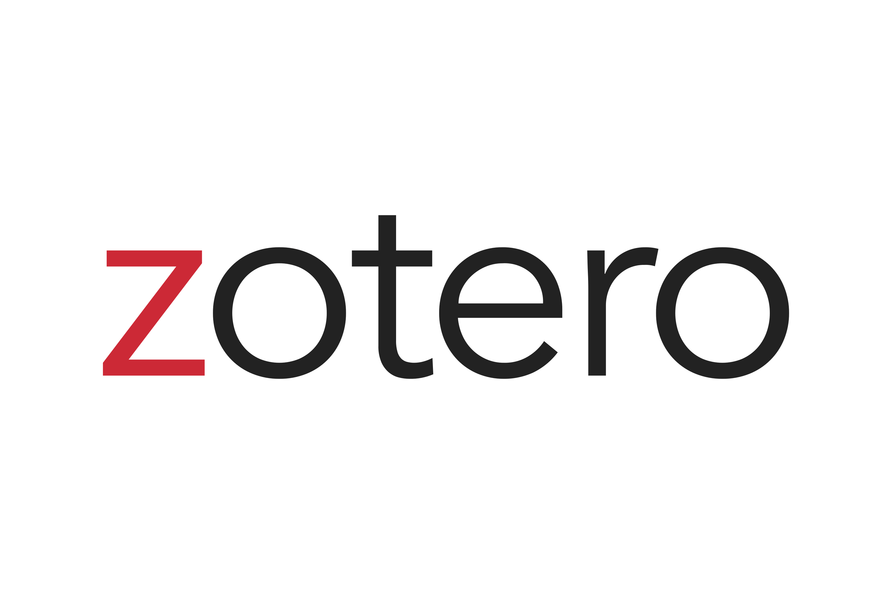
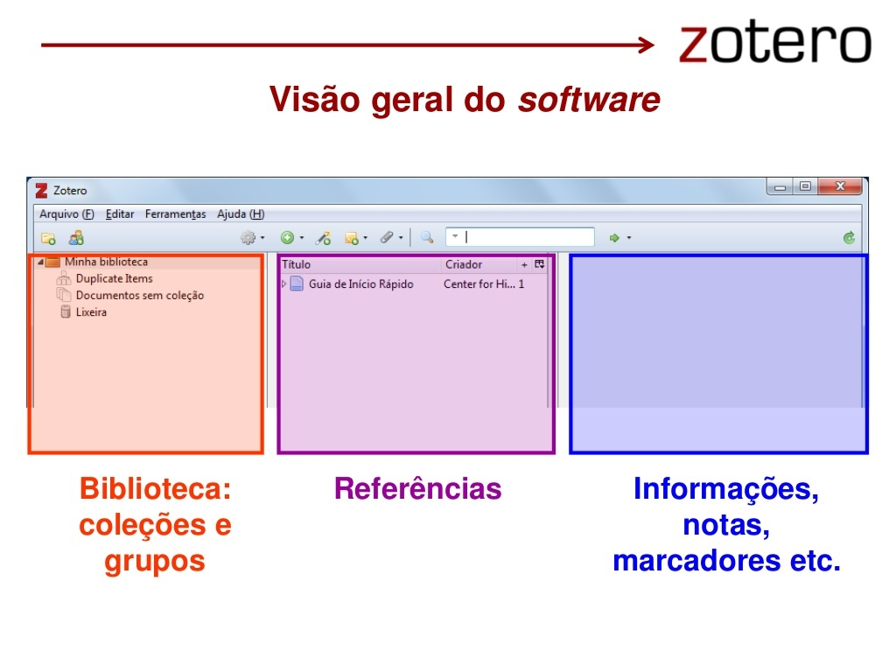
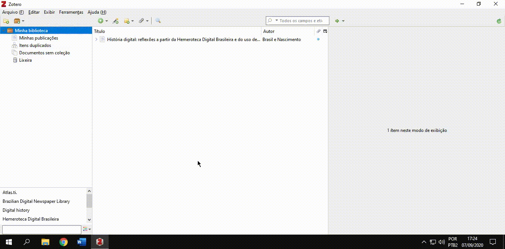
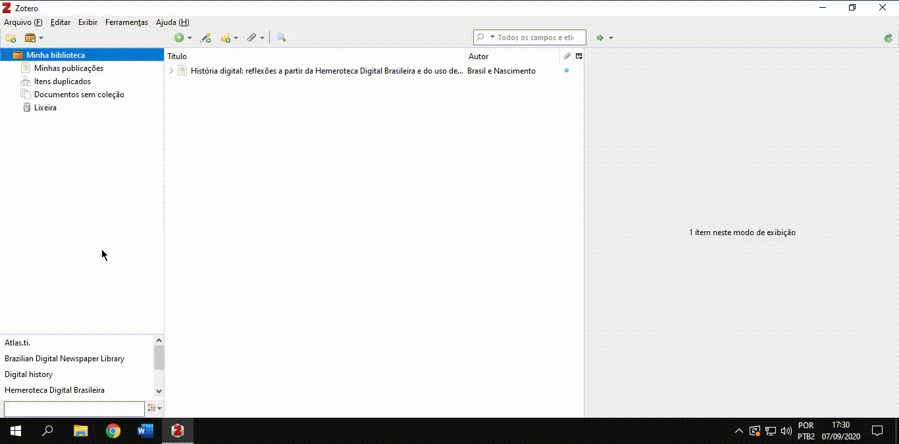
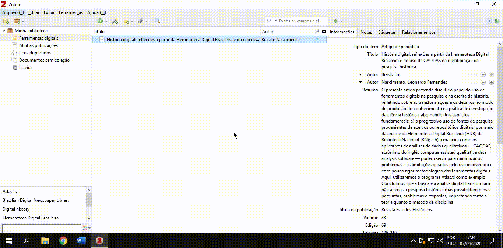
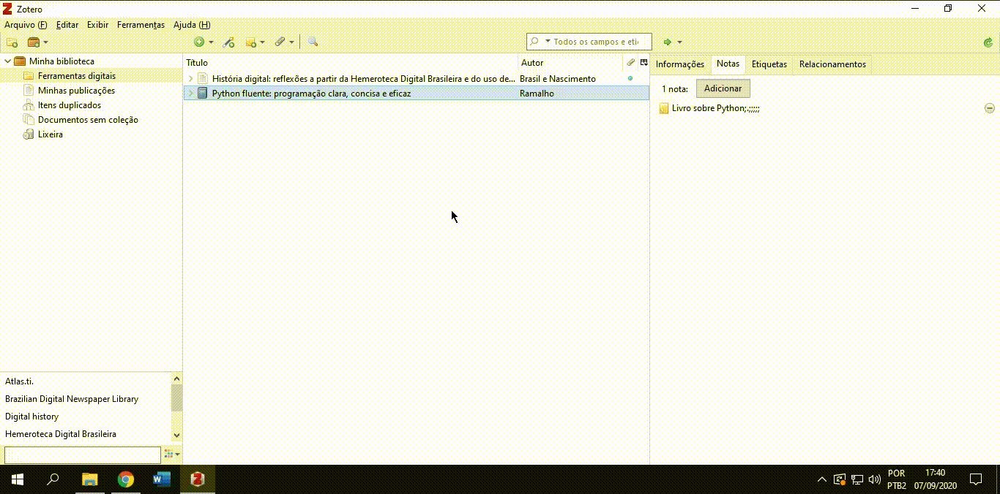
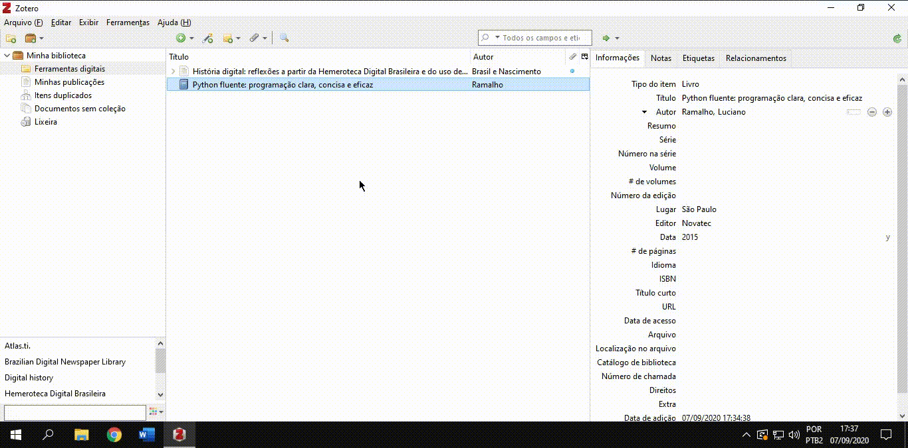
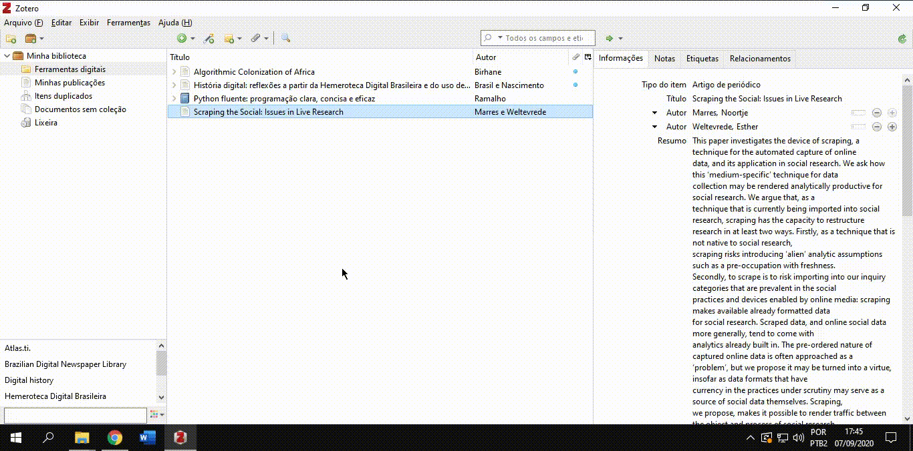
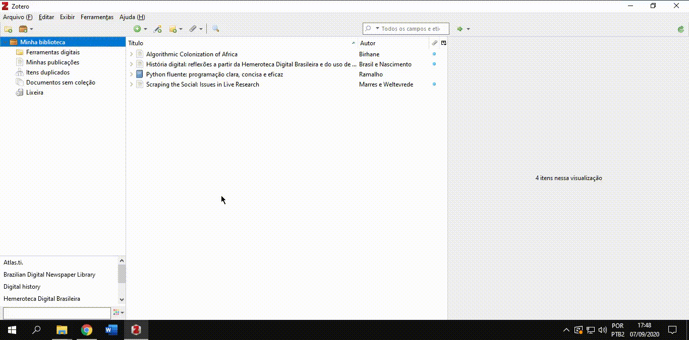

# Aula síncrona 3 - Workshop de Zotero

Professor [_Eric Brasil_](https://ericbrasiln.github.io)

***

**Ferramentas digitais e a pesquisa em humanidades**

**Instituto de Humanidades e Letras, campus dos Malês, Universidade da Integração Internacional da Lusofonia Afro-brasileira (UNILAB)**

**Data**: 08 de setembro de 2020

**Carga Horária**: 1h

**Horário**: 19h às 20h

***

## Apresentação: pra que serve o Zotero?

- Buscar, armazenar e organizar uma biblioteca pessoal de referências;
- Gerar citações e bibliografias em textos acadêmicos e ciêntíficos em diversos estilos de normas;
- Criar notas sobre os textos lidos;
- Compartilhar referências com outros/as pesquisadores/as através de bibliotecas de grupos on-line;
- É um software livre e aberto.

## Visão geral do _software_

1. **Biblioteca: coleções e grupos** - Coleções de referências (pastas) que podem ser organizadas como você desejar.
2. **Referências**: Lista de referências que estão dentro da coleção (pasta) que foi selecionada.
3. **Informações**: Informações de cada referência, tais como título, autor, ano de publicação,  resumo e etc.
- **OBS**: Os artigos que estão com uma bolinha azul do lado significa que possuem um anexo, como por exemplo o texto completo em PDF.

## Configuração inicial: _Preferências_
<small>(Clique nos títulos para visualizar os vídeos em nova aba)</small>

**Citação**:

- [**Estilos**](gifs/zt-p.gif){:target="_blank"}

{:target="_blank"}

- [**Processadores de texto**](gifs/zt-p2.gif){:target="_blank"}

{:target="_blank"}

***

## Ferramentas básicas
      

<small>Clique nos títulos para visualizar os vídeos em nova aba</small>

-[***Nova Coleção***](gifs/zt-nc.gif){:target="_blank"}

{:target="_blank"}

***

- [***Novo Item***](gifs/zt-ni.gif){:target="_blank"}

{:target="_blank"}

***

- [***Varinha Mágica***](gifs/zt-vm.gif){:target="_blank"}

{:target="_blank"}

***

- [***Nova Nota***](gifs/zt-nn.gif){:target="_blank"}

{:target="_blank"}

***

- [***Adicionar Anexo***](gifs/zt-an.gif){:target="_blank"}

{:target="_blank"}

***

- [***Busca Avançada***](gifs/zt-bu.gif){:target="_blank"}

{:target="_blank"}

***

### Importar pesquisas de bases de dados on-line
1. [Base Scielo](http://www.scielo.org){:target="_blank"}

{:target="_blank"}

## Utilizando a extensão do Zotero em seu editor de texto

<small>Continua...</small>