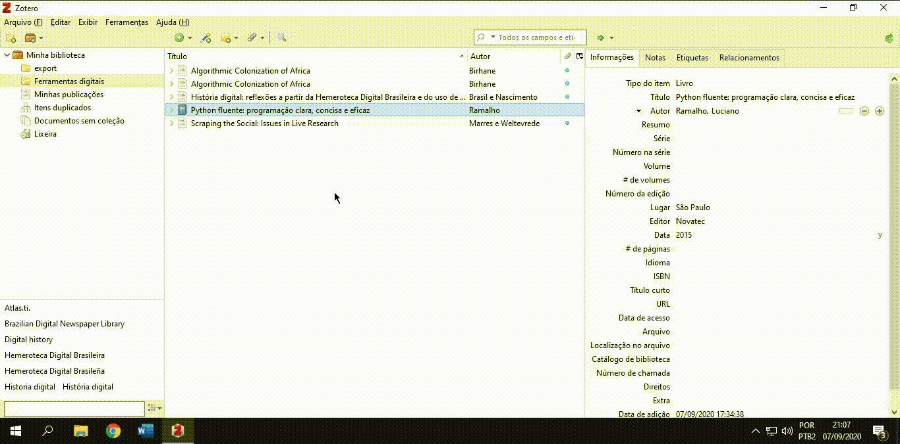
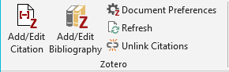
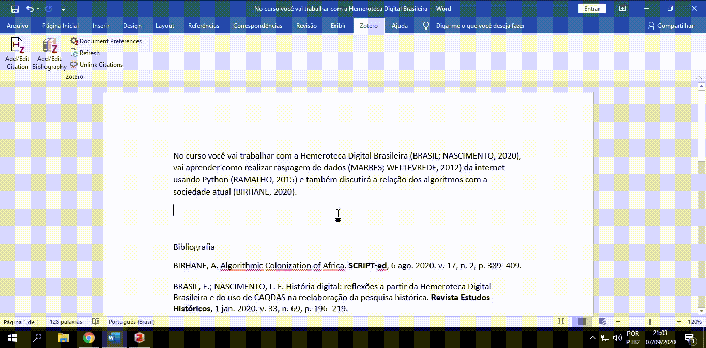

# Aula síncrona 3 - Workshop de Zotero

Professor [_Eric Brasil_](https://ericbrasiln.github.io)

---

**Ferramentas digitais e a pesquisa em humanidades**

**Instituto de Humanidades e Letras, campus dos Malês, Universidade da Integração Internacional da Lusofonia Afro-brasileira (UNILAB)**

**Data**: 08 de setembro de 2020

**Carga Horária**: 1h

**Horário**: 19h às 20h

---

## Apresentação: pra que serve o Zotero?

- Buscar, armazenar e organizar uma biblioteca pessoal de referências;
- Gerar citações e bibliografias em textos acadêmicos e ciêntíficos em diversos estilos de normas;
- Criar notas sobre os textos lidos;
- Compartilhar referências com outros/as pesquisadores/as através de bibliotecas de grupos on-line;
- É um software livre e aberto.

---

## Download, instalação, criação de conta e uso da extensão no Google Chrome

**Zotero do Zero**: ***Tutorial de instalação do Zotero***

<iframe width="560" height="315" src="https://www.youtube.com/embed/CPdhyKboKC0" frameborder="0" allow="accelerometer; autoplay; encrypted-media; gyroscope; picture-in-picture" allowfullscreen></iframe>

---

## Visão geral do _software_

1. **Biblioteca: coleções e grupos** - Coleções de referências (pastas) que podem ser organizadas como você desejar.
2. **Referências**: Lista de referências que estão dentro da coleção (pasta) que foi selecionada.
3. **Informações**: Informações de cada referência, tais como título, autor, ano de publicação,  resumo e etc.
- **OBS**: Os artigos que estão com uma bolinha azul do lado significa que possuem um anexo, como por exemplo o texto completo em PDF.

## Configuração inicial: _Preferências_
><small>(Clique nos vídeos para visualizar em nova aba)</small>

**Citação**:

- **Estilos**

<a href="gifs/zt-p.gif" target="_blank">

</a>

---

- **Processadores de texto**

<a href="gifs/zt-p2.gif" target="_blank">

</a>

---

## Ferramentas básicas

<small>Clique nos vídeos para visualizar em nova aba</small>

- ***Nova Coleção***

<a href="gifs/zt-nc.gif" target="_blank">

</a>

---

- ***Novo Item***

<a href="gifs/zt-ni.gif" target="_blank">

</a>

---

- ***Varinha Mágica***

<a href="gifs/zt-vm.gif" target="_blank">

</a>

---

- ***Nova Nota***

<a href="gifs/zt-nn.gif" target="_blank">

</a>

---

- ***Adicionar Anexo***

<a href="gifs/zt-an.gif" target="_blank">

</a>

---

- ***Busca Avançada***

---

- ***Etiquetas***

<a href="gifs/zt-tags.gif" target="_blank">

</a>

---

### Importar pesquisas de bases de dados on-line
1. [Base Scielo](http://www.scielo.org){:target="_blank"}

<a href="gifs/zt-scielo.gif" target="_blank">

</a>

---

## Utilizando a extensão do Zotero em seu editor de texto

>Esses recursos são fundamentais para o processo de escrita acadêmica e científica. Possibilitam a inserção e edição de citações, atualização dos estilos das normas e a inclusão de bibliografia.

<a href="gifs/zt-w1.mp4" target="_blank">

</a>

<a href="gifs/zt-w2.mp4" target="_blank">

</a>

---

## Dica bônus: conectar o Zotero ao Sci-hub

<a href="https://sci-hub.se/">

</a>

Para que o Zotero tente baixar o PDF da referência desejada utilizando o Sci-hub siga os seguintes passos:

Preferências > Avançado > Editor de configurações;

Procure por:
`extensions.zotero.findPDFs.resolvers`

Clique com o botão direito e depois clique em `Modify`;

Apague o `[]` e cole o seguinte:
~~~
{
    "name":"Sci-Hub",
    "method":"GET",
    "url":"https://sci-hub.se/{doi}",
    "mode":"html",
    "selector":"#pdf",
    "attribute":"src",
    "automatic":true
}
~~~

---

## Links úteis
* [Manual do Zotero](textos/SIMONINI-zotero.pdf){:target="_blank"}

* [_Capacitação para uso do Zotero_, Biblioteca da UDESC](https://www.youtube.com/watch?v=aJnKjsFCva0){:target="_blank"}
