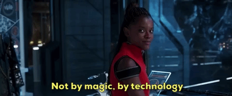
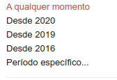
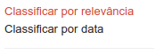
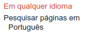
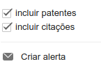
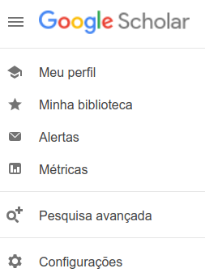
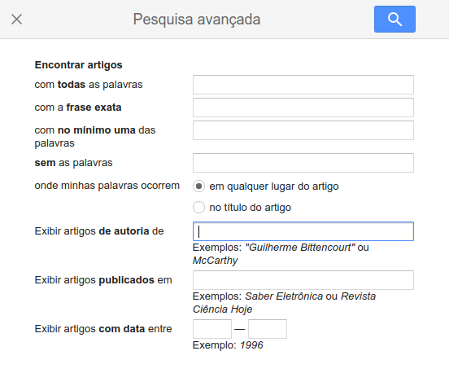

# Aula síncrona 5 - 💻️ Acessando fontes on-line: o caso da Hemeroteca Digital Brasileira – Biblioteca Nacional

Professor [_Eric Brasil_](https://ericbrasiln.github.io){:target="_blank"}

---

Ferramentas digitais e a pesquisa em humanidades

Instituto de Humanidades e Letras, campus dos Malês, Universidade da Integração Internacional da Lusofonia Afro-brasileira (UNILAB)

**Data**: 22 de setembro de 2020

**Carga Horária**: 1h

**Horário**: 19h às 20h

---

## Índice

- [O que é? Pra que fazer?](#o-que-é-pra-que-fazer)
- [Como fazer?](#como-fazer)
- [O Levantamento bibliográfico on-line](#o-levantamento-bibliográfico-on-line)
  - [GOOGLE it](#google-it)
- [Google Scholar](#google-scholar)
- [Busca avançada em repositórios específicos](#%EF%B8%8F-busca-avançada-em-repositórios-específicos)
  - [Teses e dissertações](#teses-e-dissertações)
  - [Repositórios de acesso restrito](#repositórios-de-acesso-restrito)
-[A batalha pela ciência aberta](#%EF%B8%8F-a-batalha-pela-ciência-aberta)
- [Plataformas de currículos e acervos pessoais](#plataformas-de-currículos-e-acervos-pessoais)
- [Links úteis](#%EF%B8%8F-links-úteis)
- [Licença](#licença)

---

## Pesquisa na era da abundância?

{::options parse_block_html="false" /}

<blockquote class="twitter-tweet">
Historiadores do meu Br: como a gente vai guardar esse material q as mídias sociais produzem? To achando que daqui a 30 anos nao vai ter material pra pesquisar o cotidiano da pandemia, por exemplo. Temos q começar uma discussão sobre como guardar esse material (se ja tem me diga)
&mdash; Renata (@RenataFM) <a href="https://twitter.com/RenataFM/status/1308222908817444865?ref_src=twsrc%5Etfw">September 22, 2020</a></blockquote>

- Escassez ou abundância na era da internet?

- Como definir e tratar fontes que são assim:

~~~
01000001 01101111 00100000 01110110 01100101 01110010 01101101 01100101 00100000 01110001 01110101 01100101 00100000 01110000 01110010 01101001 01101101 01100101 01101001 01110010 01101111 00100000 01110010 01101111 01100101 01110101 00100000 01100001 01110011 00100000 01100110 01110010 01101001 01100001 01110011 00100000 01100011 01100001 01110010 01101110 01100101 01110011 00100000 01100100 01101111 00100000 01101101 01100101 01110101 00100000 01100011 01100001 01100100 11100001 01110110 01100101 01110010 00100000 01100100 01100101 01100100 01101001 01100011 01101111 00100000 01100011 01101111 01101101 01101111 00100000 01110011 01100001 01110101 01100100 01101111 01110011 01100001 00100000 01101100 01100101 01101101 01100010 01110010 01100001 01101110 11100111 01100001 00100000 01100101 01110011 01110100 01100001 01110011 00100000 01101101 01100101 01101101 11110011 01110010 01101001 01100001 01110011 00100000 01110000 11110011 01110011 01110100 01110101 01101101 01100001 01110011 00101110 
~~~

<small>Tradução: 'Ao verme que primeiro roeu as frias carnes do meu cadáver dedico como saudosa lembrança estas memórias póstumas.'</small>

>os historiadores precisam pensar simultaneamente sobre como pesquisar, escrever e ensinar em um mundo de abundância histórica inédita e como evitar um futuro de escassez de registros. [...] O ‘sistema’ para preservar o passado que evoluiu ao longo dos séculos está em crise, e os historiadores precisam ajudar na construção de um novo sistema para o próximo século.

Roy Rosenzweig, Scarcity or Abundance? Preserving the Past in a Digital Era, _The American Historical Review_, Volume 108, Issue 3, June 2003, Pages 735–762, https://doi.org/10.1086/ahr/108.3.735

---

e **digitalmente**?

---

## 🗃️ O caso da Hemeroteca Digital Brasileira, da Biblioteca Nacional

- qqqq

### Breve Histórico

**Apenas um buscador de conteúdo?**

[Google acha que ferramenta em mão negra é uma arma](https://tarciziosilva.com.br/blog/google-acha-que-ferramenta-em-mao-negra-e-uma-arma/){:target="_blank"}, de [Tarcizio Silva](https://twitter.com/tarciziosilva){:target="_blank"}

---

## Google Scholar

✅️ Faça um perfil, pois assim a partir de suas buscas e seus favoritos, o Scholar vai te indicar artigos relacionados;

✅️ Indexador que engloba revistas avaliadas por pares, livros, citações, etc.

✅️ Operadores:

**AND** : busca referências com duas palavras -  `história AND digital`

**OR**: uma palavra ou outra - `história OR sociologia`

**-** (negativo): exclui termo da busca - `História digital -pública`

**" "** (expressão enter aspas duplas): busca a expressão exata - `"métodos digitais"`

- É possível combinar os parâmetros: `história OR sociologia AND digital` ou `cidadania AND pós-abolição AND carnaval -"rio de janeiro"` ou ainda `author:ALBUQUERQUE "cidadania negra" AND Salvador`

**allintitle:** - fazer a busca apenas no título - `allintitle: história digital`

**author:** - buscar autor específico - `author:Fanon, F.`

✅️ Filtros da busca (localizados no lado esquerdo):

**Definir período**:

**Classificar por relevância ou data**:

**Definir idioma:**

  

**Definir se inclui patentes e citações e criar alerta para a busca:**

✅️ Bônus: Rápido tour pelo menu (no topo, à esquerda):

**Pesquisa Avançada**:

Dicas inspiradas pela [thread no Twitter de Tarcizio Silva](https://twitter.com/tarciziosilva/status/1303347668123635714){:target="_blank"}

---

## 🗃️ Busca avançada em repositórios específicos

- [Periódicos Capes](https://www.periodicos.capes.gov.br/){:target="_blank"}

- [Domínio Público](http://www.dominiopublico.gov.br/pesquisa/PesquisaObraForm.jsp){:target="_blank"}

- [Scielo](https://www.scielo.br/scielo.php?script=sci_home&lng=pt&nrm=iso){:target="_blank"}

- [Internet Archive](https://archive.org/){:target="_blank"}

- [Projetc Gutenberg](https://www.gutenberg.org/)

- [Directory of Open Access Journals (DOAJ)](https://www.doaj.org/){:target="_blank"}

### Teses e dissertações

- [Biblioteca Digital Brasileira de Teses e Dissertações (BDTD](http://bdtd.ibict.br/vufind/){:target="_blank"}

- [Networked Digital Library of Theses and Dissertations (NDLTD)](http://www.ndltd.org/){:target="_blank"}

- [Catálogo de teses e dissertações Capes](http://catalogodeteses.capes.gov.br/catalogo-teses/#!/){:target="_blank"}

### Repositórios de acesso restrito

- [Web of Science](https://login.webofknowledge.com/error/Error?Error=IPError&PathInfo=%2F&RouterURL=https%3A%2F%2Fwww.webofknowledge.com%2F&Domain=.webofknowledge.com&Src=IP&Alias=WOK5){:target="_blank"} - **Acesso Capes**

- [Jstor](https://www.jstor.org/){:target="_blank"} - **Acesso Capes**

- [Project Muse](https://muse.jhu.edu/){:target="_blank"} - **Acesso Capes**

- [Scopus](https://www.scopus.com/home.uri) - **Acesso Capes**

- [Oxford Research Encyclopedias](https://oxfordre.com/){:target="_blank"}

---

## 🤖️ A batalha pela ciência aberta e livre

**Vc conhece essa pessoa?**

[💻️ Descubra e agradeça!](https://sci-hub.st/alexandra){:target="_blank"}

- [Sci-Hub](https://sci-hub.tw/){:target="_blank"}

- [Library Genesis](http://gen.lib.rus.ec/){:target="_blank"}

### Plataformas de currículos e acervos pessoais

- [Research Gate](https://www.researchgate.net/){:target="_blank"}

- [Academia.edu](https://www.academia.edu/){:target="_blank"}

## 📎️ Links úteis

- [Links da Biblioteca da Unilab](http://unilab.edu.br/linkssugeridos/){:target="_blank"}

- [Podcast Escafandro: Profundezas da rede - Capítulo 1: O Tabuleiro](https://www.b9.com.br/shows/escafandro/profundezas-da-rede-capitulo-1-o-tabuleiro/)

<iframe height="200px" width="100%" frameborder="no" scrolling="no" seamless src="https://player.simplecast.com/6498ec82-7fd3-40d4-9613-e4d59a17d757?dark=false"></iframe>

---

## Licença

GNU GENERAL PUBLIC LICENSE v.3.0

Copyright (C) 2020 Eric Brasil

[Voltar para o início](#aula-síncrona-4---%EF%B8%8F-levantamento-bibliográfico-on-line)

[Página inicial](https://ericbrasiln.github.io/ferramentas_digitais_UNILAB/){:target="_blank"}
